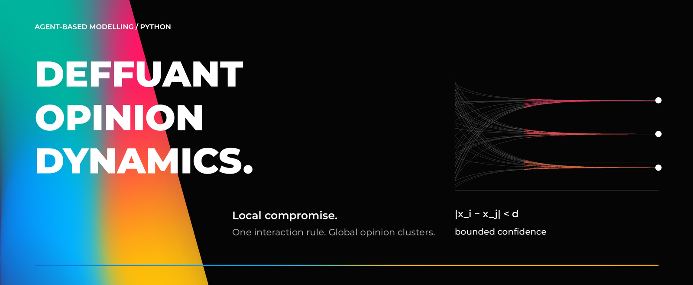
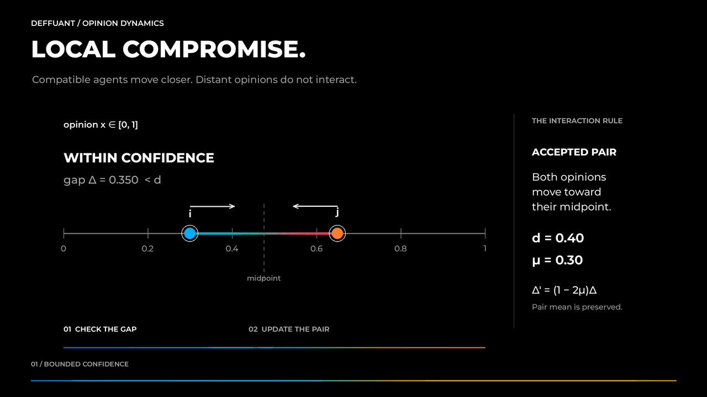
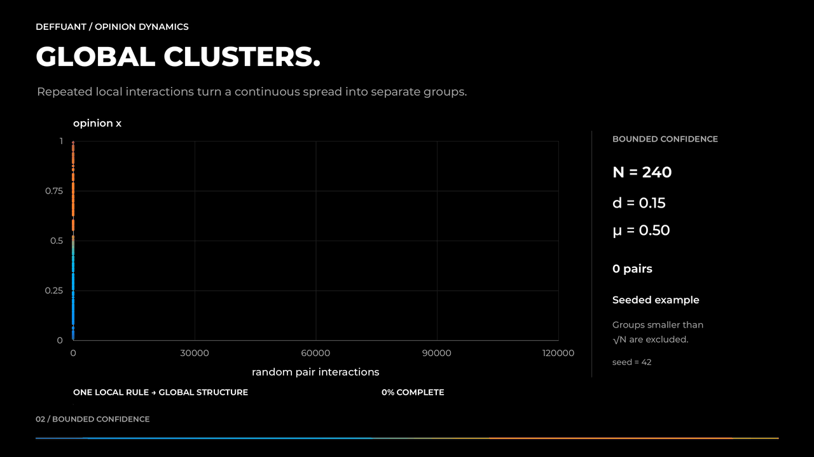
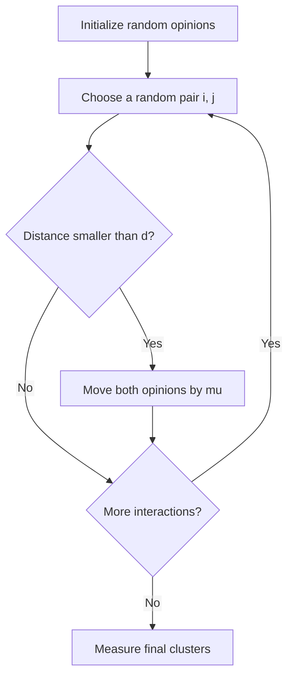
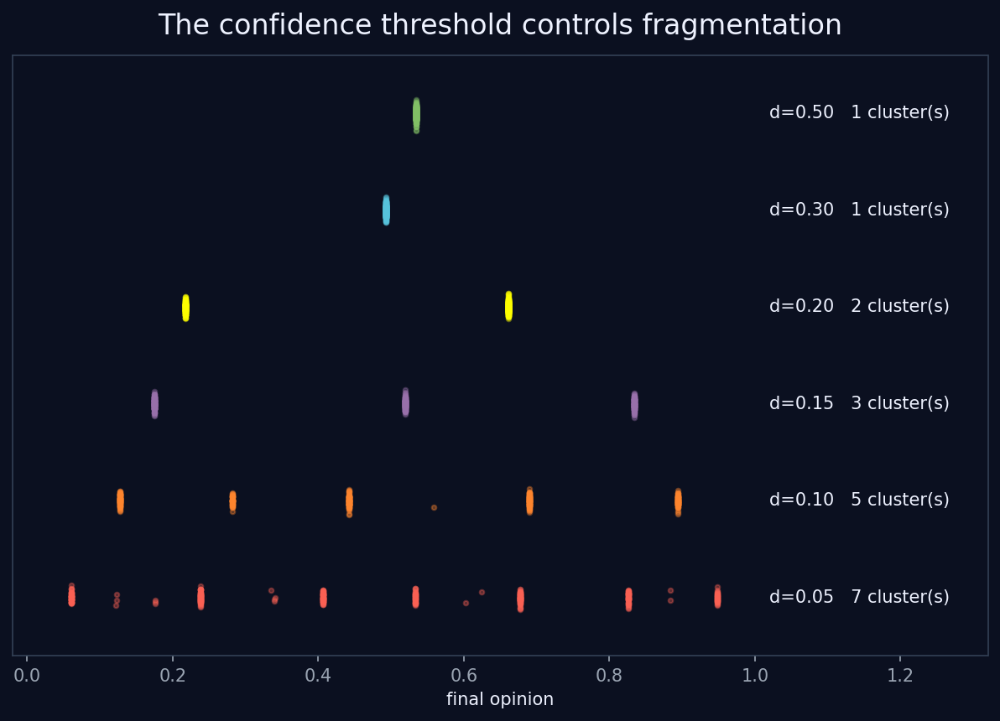
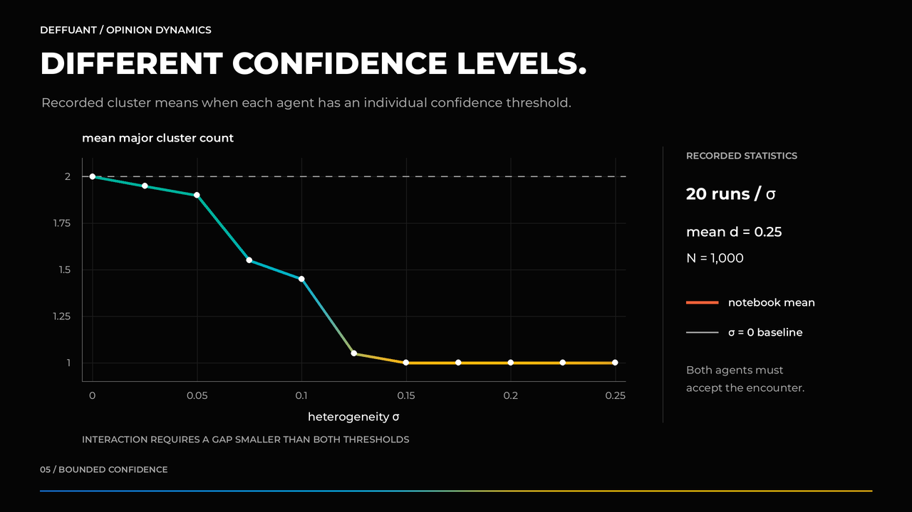

<p align="center">
  
</p>

<p align="center">
  <b>A visual exploration of bounded-confidence opinion dynamics.</b><br>
  One local interaction rule. Many emergent global structures.
</p>

<p align="center">
  
  
  
  
</p>

---

## The idea

Each agent carries one opinion

```math
x_i \in [0,1].
```

Pick two agents $i$ and $j$.

They only interact when their opinions are already close enough:

```math
|x_i-x_j| < d.
```

Here $d$ is the **confidence threshold**.

If the pair is compatible, both opinions move toward each other:

```math
\begin{aligned}
x_i' &= x_i+\mu(x_j-x_i),\\
x_j' &= x_j-\mu(x_j-x_i).
\end{aligned}
```

<p align="center">
  
</p>

A tiny local compromise rule is enough to create consensus, polarization and multiple stable opinion clusters.

---

## Why the update works

Write the interacting pair as

```math
m=\frac{x_i+x_j}{2},
\qquad
\Delta=x_j-x_i.
```

The pair average is preserved:

```math
m'=m.
```

But the distance contracts:

```math
\Delta'=(1-2\mu)\Delta.
```

So every accepted interaction pulls two compatible agents closer **without moving their midpoint**.

For $\mu=\frac12$, both agents jump directly to the midpoint.

---

## From local compromise to global clusters

The notebook repeatedly samples random pairs and applies the bounded-confidence rule.

<p align="center">
  
</p>

For smaller $d$, distant groups stop communicating and separate into persistent clusters.

---

## Algorithm at a glance



---

## The key control parameter: $d$

The confidence threshold decides **who is allowed to talk to whom**.

<p align="center">
  
</p>

The notebook compares

```math
d\in\{0.50,0.30,0.20,0.15,0.10,0.05\}
```

and observes the transition from consensus to increasingly fragmented opinion groups.

A classical heuristic used throughout the notebook is

```math
p_{\max}\approx\frac{1}{2d},
```

where $p_{\max}$ estimates the number of major clusters.

---

## What the experiments show

The repeated simulations in the notebook give the following mean cluster counts:

<p align="center">
  
</p>

The observed trend follows the expected $1/(2d)$ scaling at the qualitative level:

- large $d$ → consensus,
- intermediate $d$ → a few major clusters,
- small $d$ → strong fragmentation.

Cluster detection in the notebook ignores tiny outlier groups and isolated extremists. A group is treated as significant only when its size is at least approximately $\sqrt{N}$.

---

## What does $\mu$ change?

The parameter $\mu$ controls **how strongly** compatible agents move toward one another.

The notebook compares

```math
\mu\in\{0.05,0.1,0.3,0.5\}
```

using the same initial opinions and the same sequence of interacting pairs.

In that experiment, the final number of clusters stays the same: changing $\mu$ mainly changes the **speed and sharpness of convergence**, while $d$ is the main structural control parameter.

---

## Beyond complete mixing

The notebook then changes the geometry of interaction itself.

### Social grid

Agents are placed on an $L\times L$ lattice and interact only with one of their four local neighbors:

```math
N,\;S,\;E,\;W.
```

This turns opinion dynamics into a spatial process and produces local domains and percolation-like patterns.

### Vector opinions

Instead of one scalar opinion, each agent has a binary vector

```math
x_i\in\{0,1\}^m.
```

Interaction is controlled by Hamming distance:

```math
h(x_i,x_j)\le d.
```

For the experiment with $m=13$ and $d=3$, the notebook reports **13 unique final opinions**, with the five largest groups having sizes

```text
252, 98, 66, 41, 17
```

The observed behavior is described in the notebook as **orthogonalization rather than simple scalar polarization**.

---

## Heterogeneous confidence

The final extension gives every agent its own confidence threshold:

```math
d_i\sim\mathcal{N}(\bar d,\sigma^2),
```

clipped to $[0.01,1]$.

A pair interacts only when **both agents accept the encounter**:

```math
|x_i-x_j| < \min(d_i,d_j).
```

<p align="center">
  
</p>

For the recorded experiment with

```math
\bar d=0.25,
```

the mean number of clusters falls from about $2$ at $\sigma=0$ to $1$ once the heterogeneity becomes large enough.

The notebook interprets highly open agents as possible **bridges** between groups that would otherwise remain separated.

---

## Interactive exploration

An `ipywidgets` interface lets you change:

- confidence threshold $d$,
- convergence strength $\mu$,
- number of agents $N$,
- simulation length,
- visualization mode.

The notebook can display either temporal evolution or the final histogram together with initial-vs-final opinions.

---

## Notebook structure

| Section | Experiment |
|---|---|
| §1 | Core Deffuant functions |
| §2 | Single run: evolution, histogram, initial vs final |
| §3 | Comparison of confidence thresholds |
| §4 | Cluster statistics vs $d$ |
| §5 | Influence of $\mu$ |
| §6 | Social-grid model |
| §7 | Binary vector opinions |
| §8 | Interactive `ipywidgets` simulation |
| §9 | Heterogeneous confidence thresholds |

---

## Core implementation

```python
diff = x[j] - x[i]

if abs(diff) < d:
    x[i] += mu * diff
    x[j] -= mu * diff
```

That is the entire microscopic mechanism.

Everything else in the project studies what emerges from repeating it many times.

---

## Run the notebook

```bash
pip install -r requirements.txt
jupyter notebook
```

Open:

```text
deffuant_model-class.ipynb
```

### Dependencies

```text
numpy
matplotlib
ipywidgets
jupyter
```

---

## Project structure

```text
deffuant-opinion-dynamics/
├── README.md
├── deffuant_model-class.ipynb
├── requirements.txt
└── assets/
    ├── hero.png
    ├── interaction_rule.gif
    ├── cluster_formation.gif
    ├── confidence_thresholds.png
    ├── cluster_statistics.png
    └── heterogeneous_thresholds.png
```

---

## What this project explores

<p align="center">
  <b>How can repeated local compromise create global social structure?</b>
</p>

<p align="center">
  bounded confidence · emergent clustering · agent-based simulation · spatial interaction · heterogeneous agents
</p>
